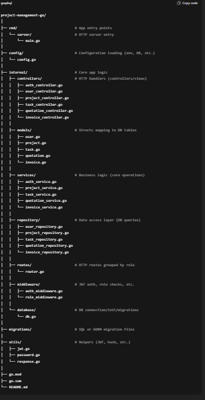

| Folder/File    | Purpose                                         |
| -------------- | ----------------------------------------------- |
| `cmd/`         | Main application entry (e.g. `main.go`)         |
| `config/`      | Load environment configs (e.g. DB URL, port)    |
| `controllers/` | Handle HTTP requests, call service layer        |
| `models/`      | Define DB schemas with GORM structs             |
| `services/`    | Contain business logic, validation, workflows   |
| `repository/`  | Direct interaction with database (CRUD)         |
| `routes/`      | Route grouping and mapping                      |
| `middleware/`  | JWT auth, role-based guards, etc.               |
| `database/`    | DB connection and initialization                |
| `migrations/`  | DB schema migrations                            |
| `utils/`       | Reusable utility functions (JWT, password hash) |

img
